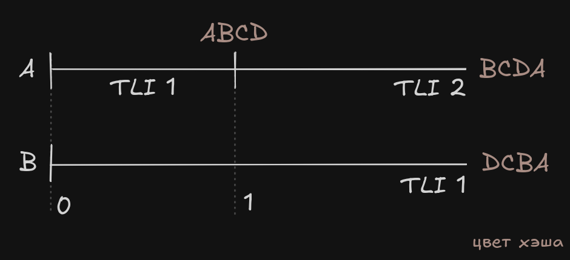

# timeline-hash-doc
## Идея

Временная линии характеризуется 3 значениями: номером, точкой начала, точкой конца. При сравнении истории временных линий, если для сравниваемых линий эти значения совпадают, они считаются одинаковыми. Однако события, происходящие в таких временных линиях могут быть различными. Текущий алгоритм считатет такие линии одинаковыми, хотя они таковыми не являются.

Предложение - для надежного сравнения историй добавить хэш всех произошедших событий в конкретной временной линии.

Хэш напрямую зависит от того, какие события происходили во временной линии. Таким образом с помощью хэша мы сможем отследить различия в событиях, даже если у временных линий совпадают остальные значения.

Количество событий в одной временной линии может быть неограниченно много, также логи событий могут переиспользоваться (затираться новыми событиями). Из этого следует, что хэш временной линии нужно вычислять последовательно, по цепочке, в течение жизни временной линии.

Основное требование к хэшу - его согласованность на основном узле и узлах-репликах. Для этого необходимо, чтобы и основной узел, и реплики вычисляли хэш по идентичным данным.

Таким образом, хэш обновляется:
1. При смене сегмента WAL, т.е. при закрытии сегмента, после которого его содержимое уже не будет изменяться;
2. При смене временной линии, при которой также происходит смена сегмента WAL;
3. В процессе восстановления (REDO), при смене сегмента, при условии, что сегмент ещё не захэширован. (PITR пока не поддерживается)

Пункт 3 гарантирует:
Обновление в процессе восстановления гарантирует:
- При падении основного узла во время хэширования, в процессе восстановления хэш будет посчитан;
- Во время репликации, реплики находятся в процессе восстановления, так что хэш будет считаться по тем же сегментам, что и в основном узле.

Чтобы использовать хэш для сравнения историй необходим механизм его сохранения. Вся цепочка временных линий до текущей содержится в `.history` файлах. Туда же записывается состояние хэша на момент завершения каждой временной линии.

Таким образом для каждой временной линии сохраняется только одно состояние хэша:
- Для завершенных временных линий - в `.history`
- Для текущей временной линии - в `pg_control`

После восстановлении истории временных линий из `.history` для двух узлов, выполняется их сравнение. Для каждой временной линии, помимо основных значений, также сверяется хэш. Если хэш различен для текущих временных линий, значит события, происходившие в этих временных линиях, различны. Следовательно, различны и сами временные линии.

## Реализация
### Список изменений
#### Изменения ядра

1. Добавлена структура `TLHashState`, описывающая состояние хэша временной линии, с полями:
    - `hash` - непосредственно хэш текущей временной линии
    - `segno` - номер текущего хэшированного сегмента
    - `tli` - номер временной линии хэшированного сегмента
    - `flags` - флаги состояний
        - `TLHASHST_INIT_FLAG` - хэш инициализирован в текущей временной линии
2. В `ControlFileData` добавлено поле, описывающее состояние хэша текущей временной линии:
    - `TLHashState hstate`
3. Функции для чтения/записи хэша в `ControlFileData`:
    - `uint64 GetCurrentTimelineHash(TLHashState*)`
    - `void SetCurrentTimelineHash(TLHashState*)`
4. Функции для обновления хэша:
   - `bool XLogUpdateHash(TimelineID, XLogSegNo)` - обновляет хэш согласно содержимого сегмента, если этот сегмент ещё не был захэширован
   - `void XLogResetHash()` - устанавливает флаг, что хэш не инициализирован после смены временной линии
   - `uint64 XLogHashSegment(TimelineID, XLogSegNo)` - считает хэш согласно содержимого сегмента, постранично (останавливается на первой нулевой странице), используя для хэширования функцию `uint64 hash_bytes_extended()`
5. Добавлено обновление хэша во время:
   - Закрытия сегмента в `XLogWrite()` → вызов `XLogUpdateHash(openLogSegNo, tli)`
   - Смены временной линии в `StartupXLOG() -> XLogInitNewTimeline()` → вызовы `XLogUpdateHash(openLogSegNo, tli)` и `XLogResetHash()`
   - Восстановаления в `StartupXLOG() -> PerformWalRecovery()` → проверка на смену сегмента + вызов `XLogUpdateHash(prev_hash_segno, prev_hash_tli
6. Добавлена функция `Datum pg_control_hash(PG_FUNCTION_ARGS)` для получения состояния хэша во время работы базы данных
7. Добавлено поле в структуру истории временной линии `TimeLineHistoryEntry`:
    - `TLHashState hstate` - состояние хэша на момент смены временной линии
8. Измененен формат чтения/записи файлов историй `.history`:
    - `TLI | LSN | HASH STATE | REASON` - добавлена запись состояния хэша для каждой временной линии
    - Формат записи `HASH STATE` - `HASH:SEGNO:TLI:FLAGS`
    - Под новый формат изменены функции `readTimeLineHistory`, `writeTimeLineHistory`
    
#### Изменения pg_rewind

1. Добавлена функция `bool matchCurrentTimelines()` для определения необходимости проводить сравнения историй в `pg_rewind.c`.
   - no rewind в случае совпадения как TLI, так и хэша для текущих временных линий Source и Target.
2. Добавлена функция `bool matchHashStates(TLHashState a, b)` для сравнения состояний хэшей
3. В алгоритм сравнения историй `findCommonAncestorTimeline()` добавлено:
    - При цикличном обходе историй сравнивается хэш `matchHashState(a[i].hstate, b[i].hstate)`
    - При рассогласовании хэша, точка разветвления - `a[i].begin == b[i].begin`

### Нюансы
#### Неоптимальность алгоритма сравнения

Рассмотрим ситуацию: временные линии имеют одинаковые события до точки `1`, в точке `1` один из узлов переходит на новую временную линию, а другой продолжает текущую.

Стандартный алгоритм, по шагам:
1. `i = 0`: Проверит TLI `1 == 1` и begin LSN `0 == 0` - совпадают
2. `i = 1`: Завершение цикла
3. Точка расхождения - TLI `1`, end LSN `1`

Хэш алгоритм, по шагам:
1. `i = 0`: Проверит TLI `1 == 1` и begin LSN `0 == 0` - совпадают
2. `i = 0`: Проверит hash `ABCD != DCBA` - не совпадают
3. Точка расхождения - TLI `1`, begin LSN `0`

Хэш описывает временную линию на момент её завершения / на текущий момент. Поэтому однозначно определить, где именно произошло расхождение - в точке `0`, или `1` мы не можем. Из-за этого точкой расхождения принимается begin LSN.

Таким образом алгоритм может копировать лишние данные, которые не расходятся, и тем самым работает медленее стандартного алгоритма.

#### PITR не поддерживается

Возврат состояния хэша к определенной точке (Point in Time) не реализовано. После PITR восстановления хэш останется старым и не будет обновляться, пока база не перейдет на временную линию с TLI > TLI хэша.